# Overview
The AD5933 is a device from Analog Devices which can perform impedance spectroscopy. It uses I2C protocol protocol and its a slave device with address of 0x0D. I used Arduino as the master device to control the AD5933. Following are the steps to do impedance spectroscopy on the device.

## Components Needed
1. AD5933
2. Arduino
3. Wires 
4. Resistors/Capacitors to test

## Softwares Needed
1. Arduino IDE for uploading code to arduino [Click here to download arduino](https://www.arduino.cc/en/software)
2. Python [Click here to download python](https://www.python.org/downloads/)

***
## When installing python check the "Add python to PATH" option.

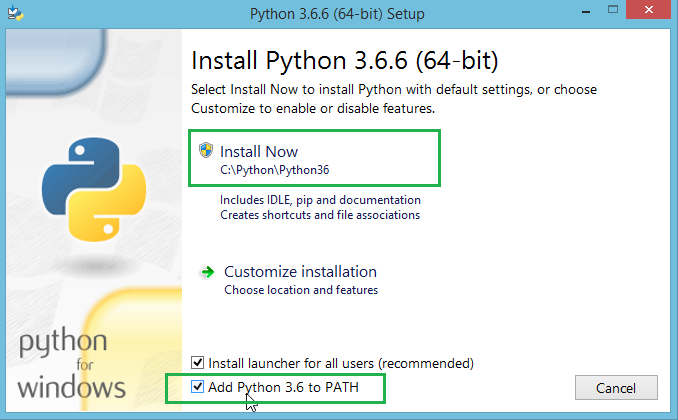
***

# Connecting Arduino with AD5933
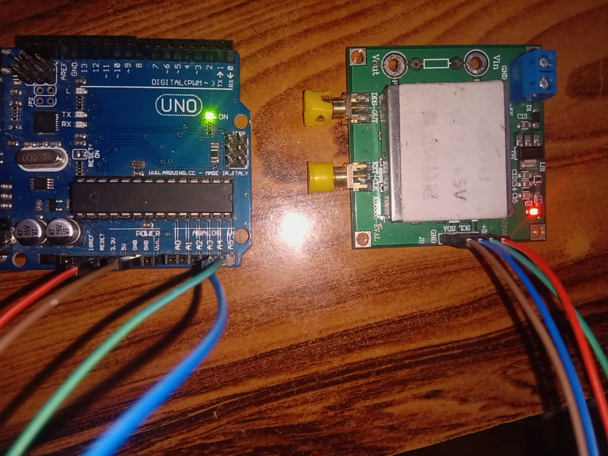

### **here are the pin connections**
1. 3.3V (Arduino)  -->  +3.3V (AD5933)
2. Gnd  (Arduino)  -->  GND (AD5933)
3. A4   (Arduino   -->  SDA (AD5933)
4. A5   (Arduino)  -->  SCL (AD5933)

## unknown impedance is connected between Vin and Vout terminals

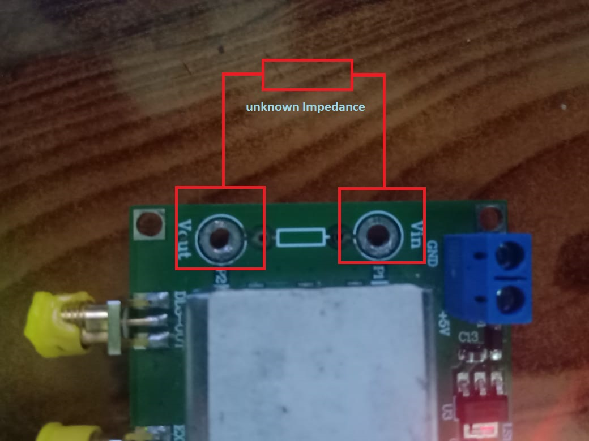

## Download the required files for AD5933 on your Computer from my github repository.

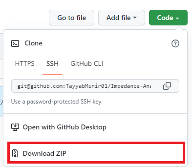

## Extract the Files.

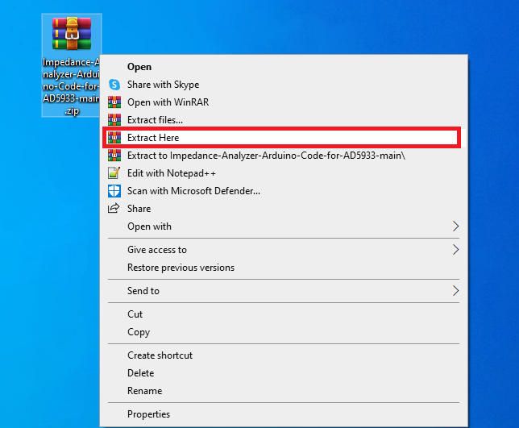

## Open the Arduino File **CodeForGuiandReg.ino**

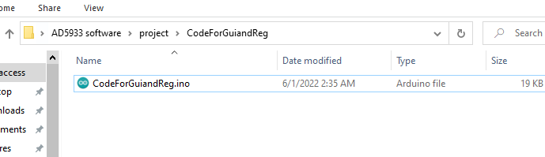

## Select the Arduino Board you are using and Port on which ardiono in connected

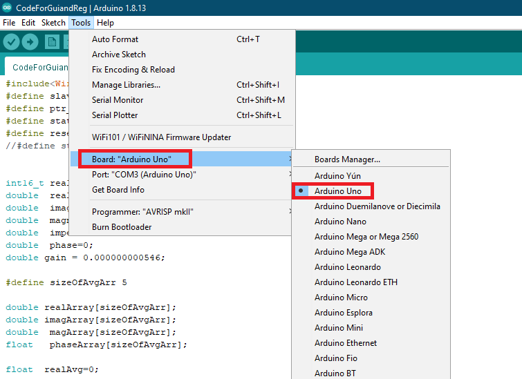

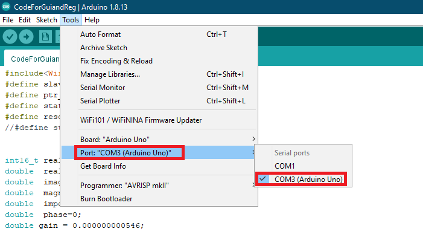

## Upload the Code on Arduino

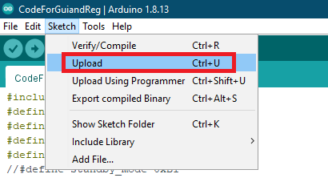

***

## Now open software file **ad5933.exe**

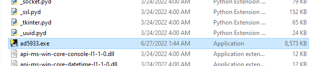

## Software Overview

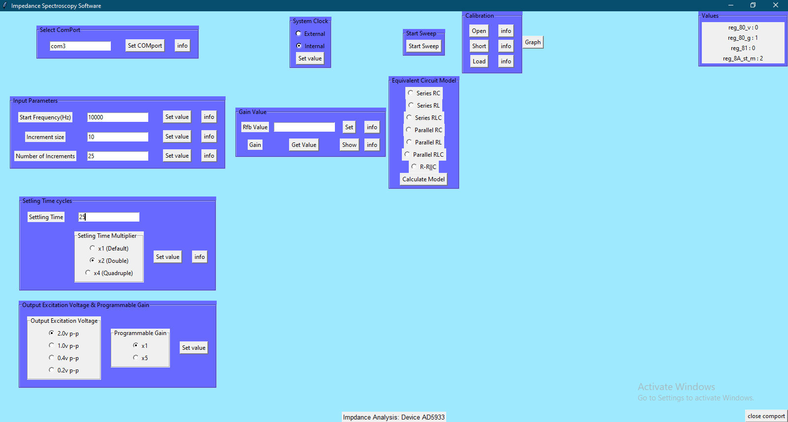

### **Steps to do Impedance spectroscopy:**
1. Write the port on which arduino is connected in selecte comport textbox.
2. Set the sweep parameters.
3. even if the voltage is set on say 2.0v p-p(and you want to do measurement with that voltage) click again on the button to set it.
4. click on internal clock even if it is selected by default for the software to set its value via arduino.
5. After setting parameters click on **start sweep** button
6. You can see live data acquisition on the terminal which automatically opens when you start the software.
7. After impedance spectroscopy is complete a message will pop-up on software **"Impedance Spectroscopy is Complete"**.
8. Click on **graph** button to see the impedance and phase plots.
9. You can also **callibrate** the device using open, short and load callibrations.
10. You can also select any **equivalent circuit model** and click on **calculate model** button to see the equivalent circuit.

